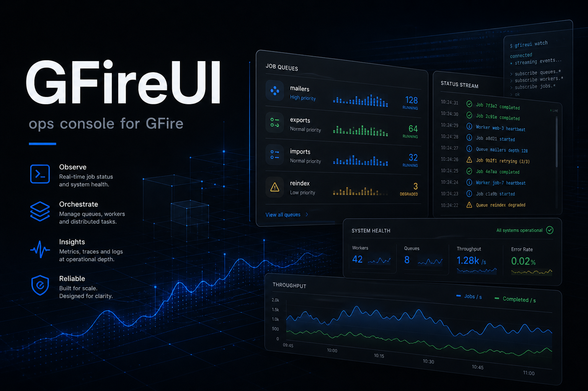

# GFireUI — ops console for GFire

<a id="readme-top"></a>

**🖥** _See the queue. Run the fleet. Leave GFire headless._

[](./VERSION)
[](https://kit.svelte.dev/)
[](./LICENSE)
[](#current-status)
[](https://github.com/hrodrig/gfireui/pkgs/container/gfireui)
[](https://github.com/hrodrig/gfireui-backend)

**Repo:** [github.com/hrodrig/gfireui](https://github.com/hrodrig/gfireui) · **Backend:** [gfireui-backend](https://github.com/hrodrig/gfireui-backend) · **Engine:** [gfire](https://github.com/hrodrig/gfire) · **Design:** [platform design](./docs/superpowers/specs/2026-08-06-gfireui-platform-design.md) · **Security:** [SECURITY.md](./SECURITY.md) · **Site:** [gfire.net](https://gfire.net)

<p align="center">
  
</p>

```
┌──────────────────────────────────────────────────────────────┐
│  GFireUI                                                     │
│  light / dark · jobs · queues · recurring · servers          │
│  users · roles · audit · live charts                         │
└────────────────────────────┬─────────────────────────────────┘
                             │ JWT
                             ▼
┌──────────────────────────────────────────────────────────────┐
│  gfireui-backend  —  BFF · RBAC · audit · thin GFire proxy   │
└────────────────────────────┬─────────────────────────────────┘
                             │ service Bearer
                             ▼
┌──────────────────────────────────────────────────────────────┐
│  gfire  —  headless job service (unchanged)                  │
└──────────────────────────────────────────────────────────────┘
```

GFireUI is the **browser console** for [GFire](https://github.com/hrodrig/gfire): a language-agnostic, HTTP-first job service. The engine stays a single binary with no embedded UI. This repo is the **SvelteKit SPA** — pixels, charts, and workflows. Identity, permissions, and the GFire proxy live in **[gfireui-backend](https://github.com/hrodrig/gfireui-backend)**.

> **Status: v0.1.4.** Semantic state UX + sliding activity chart (U-046/U-047). Production image on GHCR (tag `v0.1.4`, amd64+arm64). Pair with gfireui-backend.

**Related tools (same maintainer):**
- **[gfire](https://github.com/hrodrig/gfire)** — standalone background job service ([gfire.net](https://gfire.net))
- **[gfireui-backend](https://github.com/hrodrig/gfireui-backend)** — Go BFF for this console
- **[pgwd](https://github.com/hrodrig/pgwd)** — PostgreSQL connection watchdog
- **[gghstats](https://github.com/hrodrig/gghstats)** — GitHub traffic beyond 14 days
- **[kzero](https://github.com/hrodrig/kzero)** — bastion-first declarative workload reset
- **[groot](https://github.com/hrodrig/groot)** — Kubernetes diagnostics archive

## Table of contents

- [Why a separate UI](#why-a-separate-ui)
- [What you get (v0.1 target)](#what-you-get-v01-target)
- [Architecture](#architecture)
- [Roles](#roles)
- [Visual direction](#visual-direction)
- [Current status](#current-status)
- [Repository layout](#repository-layout)
- [Development](#development)
- [Docs](#docs)
- [License](#license)

[↑ Back to top](#readme-top)

## Why a separate UI

GFire’s wedge is **headless**: curl, CLI, Prometheus — any language, no SDK marriage. Operators still want a screen.

| Embedded UI in the engine | GFireUI (this approach) |
| ------------------------- | ----------------------- |
| Couples release cycles | Ship UI without touching `gfire` |
| One auth story for jobs + humans | Humans get users/roles; GFire keeps a service token |
| Harder multi-tenant console | BFF owns RBAC + audit |

You get Sidekiq-class **visibility** without turning GFire into a monolith.

[↑ Back to top](#readme-top)

## What you get (v0.1 target)

| Surface | Notes |
| ------- | ----- |
| **Jobs** | List, filter, detail, history, result; requeue / cancel by role |
| **Queues** | Depth and stats |
| **Recurring** | Definitions + trigger |
| **Servers** | Peer view of GFire nodes |
| **Users** | UUIDv7 identities, names, email, enable/disable, roles |
| **Audit** | Append-only trail of login and mutations |
| **Dashboard charts** | Jobs-by-state, queue depths — browser polls the BFF (2–5s) |
| **Light / dark** | Fixed palette, CSS variables; theme packs post-v1 |
| **OAuth2 / OIDC** | Post-v0.1 — federated login via backend (local JWT + roles stay) |

The browser talks **only** to `gfireui-backend`. It never holds the GFire service Bearer.

[↑ Back to top](#readme-top)

## Architecture

```
Browser ──JWT──► gfireui-backend ──Bearer──► gfire
   ▲                    │
   │                    ├── PostgreSQL (database gfireui)
   └── static SPA       └── /api/gfire/* thin proxy
```

- **This repo:** SvelteKit + TypeScript, SPA/CSR (static adapter).
- **Backend:** auth, users, audit, RBAC middleware, GFire proxy, `/api/ops/summary` for charts.
- **GFire:** unchanged REST from v1.0.0.

Full contract: [platform design](./docs/superpowers/specs/2026-08-06-gfireui-platform-design.md) (mirrored in the backend repo).

[↑ Back to top](#readme-top)

## Roles

| Role | Intent |
| ---- | ------ |
| **Administrator** | Users, config visibility, all mutations |
| **Operator** | Day-to-day job/queue/recurring actions |
| **Auditor** | Read-only ops + audit log |
| **Guest** | Account exists; console locked pending access |

Enforcement is on the **backend**. The UI hides buttons; that is not security.

[↑ Back to top](#readme-top)

## Visual direction

Ops tooling that does not look like a spreadsheet abandoned in 2014.

- **Dark:** `#1A1A1A` page · `#212222` cards · `#3B82F6` brand · semantic green / amber / coral  
- **Light:** paired neutrals, same brand and semantics  
- System preference + in-UI toggle (persisted)  
- Expressive type, purposeful motion, charts that update with each poll snapshot  
- **Post-v1:** named theme packs on the same CSS token system  

[↑ Back to top](#readme-top)

## Current status

| Item | State |
| ---- | ----- |
| Platform design | ✅ Approved 2026-08-06 |
| Scaffold (SvelteKit app) | ✅ |
| Wired to backend | ✅ (via gfireui-backend) |
| Docker Compose demo | ✅ `make compose-up` |
| OCI image + CI / GHCR / SBOM / cosign | ✅ |
| Coverage gate ≥ 80% (`src/lib`) | ✅ |
| First runnable release | ✅ **v0.1.0**; multi-arch image **v0.1.1** |

[↑ Back to top](#readme-top)

## Repository layout

```
gfireui/
├── README.md
├── VERSION
├── CHANGELOG.md
├── LICENSE
├── Dockerfile
├── package.json
├── svelte.config.js
├── src/
├── static/
└── docs/
    ├── assets/
    │   └── gfireui-hero.png
    └── superpowers/
```

[↑ Back to top](#readme-top)

## Development

**Compose (recommended):** full stack from this repo alone — needs a **local** BFF image.

```sh
# once: cook or pull the BFF image (example from a gfireui-backend checkout)
#   make -C ../gfireui-backend docker-build
# or: docker pull … when published

make compose-up
# UI  http://127.0.0.1:5173
# API http://127.0.0.1:8090/healthz
# Login: admin@example.com / adminadmin
make compose-down
```

Override image tag: `make compose-up BACKEND_IMAGE=gfireui-backend:0.1.0`.  
Do not run [gfireui-backend](https://github.com/hrodrig/gfireui-backend) compose at the same time (same `:8090` / `:5433`).

**Local Vite only** (BFF already running):

```sh
cp .env.example .env   # PUBLIC_GFIREUI_API_BASE=http://127.0.0.1:8090
npm install
npm run dev
npm run check
npm run cover          # Vitest ≥80% statements/lines on src/lib
npm run build          # static SPA → build/
```

**Production image** (nginx-unprivileged Bookworm, listen **8080**):

```sh
make docker-build PUBLIC_GFIREUI_API_BASE=http://127.0.0.1:8090
make docker-smoke      # optional: curl /
# docker run --rm -p 8088:8080 gfireui:$(cat VERSION)
```

### Release quality (fail-closed)

- Tag `v*` only from `main` after merging `develop`.
- Local bar before tagging: `make release-check` (`npm audit --audit-level=high`, svelte-check, cover ≥80% on `src/lib`, production build; docker-build when Docker is up).
- Tag workflow re-runs `make release-check` **before** buildx push to GHCR (syft SBOM + cosign keyless).
- Red gate = no image, no GitHub Release assets.

Ops packaging: [gfire-selfhosted](https://github.com/hrodrig/gfire-selfhosted). Ops screens need a reachable **[gfire](https://github.com/hrodrig/gfire)** via `GFIREUI_BACKEND_GFIRE_*` on the BFF.

[↑ Back to top](#readme-top)

## Docs

| Document | Role |
| -------- | ---- |
| [Platform design](./docs/superpowers/specs/2026-08-06-gfireui-platform-design.md) | Approved architecture & UX contract |
| [OCI / CI / quality](./docs/superpowers/specs/2026-08-08-gfireui-oci-ci-quality-design.md) | Image, cover ≥80%, GHCR, SBOM, cosign |
| [SPECIFICATIONS.md](./SPECIFICATIONS.md) | Behavior + image contract |
| [ROADMAP.md](./ROADMAP.md) | Band status |
| [SECURITY.md](./SECURITY.md) | Vulnerability reporting (private advisories) |
| [gfireui-backend](https://github.com/hrodrig/gfireui-backend) | BFF, auth, audit, proxy |
| [GFire SPEC](https://github.com/hrodrig/gfire/blob/main/SPECIFICATIONS.md) | Engine behavior |

[↑ Back to top](#readme-top)

## License

[MIT](./LICENSE) © Hermes Rodriguez

[↑ Back to top](#readme-top)
